# Enterprise Threat Detection & NCA-ECC Compliance Lab
**Target Role:** Security Operations Center (SOC) Analyst / Security Engineer

> [!TIP]
> **Lab Status:** Operational 🟢 | **Simulated Threat Level:** High | **Compliance Focus:** Saudi NCA-ECC (2018/2024)
> 
> **Key Achievement:** Successfully automated the detection-to-response pipeline, reducing MTTR for Brute Force attacks from minutes to <5 seconds using Wazuh Active Response.

---

## 🎯 Project Overview
This project demonstrates the end-to-end deployment of a **Security Operations Center (SOC)** environment. I have engineered a resilient monitoring system using **Wazuh (SIEM)** and **Sysmon** to detect advanced persistent threats (APTs) and common attack vectors.

The lab is specifically designed to align with the **National Cybersecurity Authority (NCA) Essential Cybersecurity Controls (ECC)**, simulating the security posture required for a major Saudi industrial entity like **SABIC**.

---

## 🛠️ Core Competencies & Tools
* **SIEM:** Wazuh (Manager, Indexer, Dashboard)
* **Telemetry:** Windows Sysmon (SwiftOnSecurity/MITRE Config)
* **Networking:** VirtualBox Bridged Networking, TCP/IP, Port 1514
* **Compliance:** Saudi NCA-ECC 2024 Framework
* **Security Research:** Threat Hunting, Log Analysis, Attack Simulation

---

## 🏗️ Technical Architecture
The lab simulates a corporate DMZ and internal network segment. Using a **Hub-and-Spoke** model, the Wazuh Manager acts as the central intelligence hub, receiving encrypted telemetry from distributed endpoints.

### **Logical Network Map**

```mermaid
graph LR
    subgraph "Internal Network (Victim Zone)"
        WIN["🖥️ Windows 10 Enterprise<br/>(Endpoint-01)"]
        SYSMON["⚙️ Sysmon Service<br/>(MITRE-Mapped)"]
        WIN --- SYSMON
    end

    subgraph "Security Operations Zone (Monitoring)"
        WAZUH["🛡️ Wazuh SIEM Server<br/>(Manager)"]
        DASH["📊 Web Dashboard<br/>(Port 443)"]
        WAZUH --- DASH
    end

    %% Encrypted Tunnel
    SYSMON -- "Encrypted Logs (Port 1514)" --> WAZUH
```

## 📑 Incident Response Workflow
For every simulation, I follow the standard IR lifecycle to ensure consistency and compliance with **NCA-ECC-3-1** (Incident Management):

* **Preparation**: Hardening endpoints with **Sysmon** utilizing a MITRE-mapped configuration for deep telemetry visibility.
* **Identification**: Real-time log correlation and alerting via the **Wazuh Ruleset**.
* **Containment**: Implementation of automated IP blocking via **Wazuh Active Response**.
* **Eradication/Recovery**: Verification of process termination and secure retention of forensic logs.
* **Lessons Learned**: Mapping detections back to the **NCA-ECC** framework for continuous defense improvement.

---

## 🛡️ Attack Simulation & Detection Evidence

### **Test Case: Brute Force Attack (Authentication Failure)**

#### **Incident Overview**
* **Attack Technique**: Brute Force / Credential Guessing
* **Target Asset**: `Endpoint-01` (Windows 11 Enterprise)
* **Detection Goal**: Identify high-frequency authentication failures and map process lineage
* **NCA-ECC Alignment**: **ECC-3-1** (Incident Management)

#### **Technical Analysis & Evidence**

**Phase 1: Inbound Telemetry (Sysmon Process Tree)**
The attack was initiated via a PowerShell script that leveraged a loop to spawn multiple `net.exe` processes. This "Living off the Land" (LotL) technique was captured using **Sysmon Event ID 1**, providing deep visibility into the parent-child relationship of the malicious activity.

> **Forensic Evidence (Process Creation):**
> 
> *Figure 1: Telemetry confirms `powershell.exe` as the parent of `net.exe` with the specific command line used for the attack.*

**Phase 2: SIEM Alerting (Wazuh Dashboard)**
The **Wazuh Manager** successfully correlated the rapid succession of failed attempts. As seen in the telemetry, the pattern of multiple failures (10+) occurring in under 5 seconds distinguishes this as an automated script rather than a human error, triggering a priority alert.

> **Forensic Evidence (Detection Summary):**
> 
> *Figure 2: Wazuh alerting on **Rule 60122** (Logon Failure) and **Rule 92037** (Network Connection).*

**Phase 3: Forensic Deep Dive**
By analyzing the specific alert details, we can isolate the targeted account and the specific error codes generated by the Windows Security Log (Event ID 4625).

> **Forensic Evidence (Alert Details):**
> 
> *Figure 3: Expanded alert view showing the source agent and specific logon failure rule match for the account `SABIC_Hacker_Trial`.*

#### **Forensic Conclusion**
| Field | Value | Significance |
| :--- | :--- | :--- |
| **Parent Image** | `powershell.exe` | Indicates script-based execution |
| **Target User** | `SABIC_Hacker_Trial` | Confirms unauthorized account targeting |
| **Alert Level** | 5 | Triggers initial SOC triage |

---

### **🛡️ Mitigation Strategy: Automated Active Response**
To move from passive monitoring to proactive defense, the following mitigation strategy was implemented to align with **NCA-ECC-3-1** (Incident Management).

* **The Solution**: Enabled **Wazuh Active Response** to provide real-time protection.
* **The Action**: The system is configured to automatically block the source IP address at the firewall level once an attack pattern is confirmed.
* **Trigger Threshold**: The block is activated after **5 failed login attempts within 60 seconds**, significantly reducing the window for a successful brute force.
* **Business Value**: This automation reduces the **Mean Time to Respond (MTTR)** and ensures critical assets remain available by preventing resource exhaustion.

---

### **✅ Technical Validation**
To ensure the integrity of the detection pipeline, I performed the following verification steps:
* **Log Ingestion**: Confirmed `ossec.log` on the Wazuh Manager received all 10 failed logon events in real-time.
* **Rule Accuracy**: Verified that **Rule ID 60122** triggered specifically for the `SABIC_Hacker_Trial` account.
* **Response Latency**: Measured a **<3 second delay** between the final attack attempt and the firewall block activation.

---

### **🇸🇦 Saudi NCA-ECC Compliance Summary**
| Control ID | Control Name | Lab Implementation |
| :--- | :--- | :--- |
| **ECC-2-8-1** | Event Logging | Centralized ingestion of Sysmon & Windows Security logs. |
| **ECC-2-8-3** | Monitoring & Analysis | Real-time dashboard visualization and alert generation. |
| **ECC-3-1-2** | Incident Detection | Multi-stage detection of Brute Force using telemetry correlation. |
| **ECC-3-1-3** | Incident Response | Automated containment via firewall/Active Response integration. |
